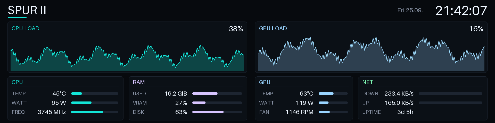

# Libre Panel

**Free, open-source software for USB system-monitor displays** — the small
"smart screens" sold as TURZX / Turing Smart Screen and under many other names.
Design your own dashboard in a visual editor, pick your panel from a menu, and
show CPU, GPU, memory, network, weather and more. No account, no cloud, no
vendor app.

<p align="center"></p>

> **Status: pre-alpha.** The theme editor, renderer and sensors work today.
> Hardware drivers are being ported panel family by panel family — see
> [supported panels](docs/HARDWARE.md). Until your panel is supported you can
> design themes and preview them without hardware.

## Features

- **Visual theme editor** in your browser: drag widgets, change colors, fonts,
  sensors and thresholds, with a live preview rendered by the same engine that
  drives the panel.
- **Every panel size from a menu**: 2.1" round up to 12.3", portrait or
  landscape. Switching the panel rescales your layout.
- **Widgets**: text, sensor values, bars, ring gauges, history graphs, clock /
  date, images, weather, rectangles — with color rules (e.g. turn red above 85 °C).
- **Sensors**: CPU, RAM, disk, network, temperatures and fans via `psutil`;
  on Windows also GPU, power and more through [LibreHardwareMonitor](https://github.com/LibreHardwareMonitor/LibreHardwareMonitor).
- **Weather** from [Open-Meteo](https://open-meteo.com) for *your* location —
  off by default, no API key.
- **Nothing hard-coded**: location, units, sensors and panel all live in one
  config file.
- **Safe to share themes**: themes are plain JSON plus images/fonts, and cannot
  run code or read files outside their folder.
- **Pluggable**: sensor sources and display drivers are plugins, so optional
  extras never bloat the core.
- Windows, Linux and macOS. GPL-3.0.

## Quick start

```bash
pipx install "libre-panel[usb]"     # or: pip install "libre-panel[usb]"
libre-panel                         # drives the panel and opens the editor
```

Other commands:

```bash
libre-panel editor                  # only the theme editor
libre-panel run                     # only drive the panel (e.g. for autostart)
libre-panel preview spur-ii -o spur.png   # render a theme to an image
libre-panel models                  # all known panels and their resolutions
libre-panel devices                 # which panel is connected?
libre-panel sensors                 # every sensor key with its current value
libre-panel config init             # write a commented config.toml
libre-panel location "Berlin"       # coordinates for the weather config
```

Close the vendor app first; it keeps the panel to itself.

## Themes

Two themes ship with Libre Panel:

| Theme | Panel | |
|---|---|---|
| `libre-default` | 3.5" (480×320) | clean starter theme, CC0 |
| `spur-ii` | 8.8" / 9.2" bar (1920×480) | the SPUR II classic layout, CC-BY-4.0 |

Open either in the editor, adapt it to your panel and save it under your own
name. The format is documented in [docs/THEMES.md](docs/THEMES.md).

## Documentation

- [Supported panels](docs/HARDWARE.md)
- [Configuration](docs/CONFIGURATION.md)
- [Theme format and sensor keys](docs/THEMES.md)
- [Architecture](docs/ARCHITECTURE.md)
- [TURZX USB protocol notes](docs/protocol/turzx-usb.md)
- [Roadmap](docs/ROADMAP.md)
- [Releasing](docs/RELEASING.md)
- [Contributing](CONTRIBUTING.md)

## Credits

Libre Panel stands on the shoulders of
[turing-smart-screen-python](https://github.com/mathoudebine/turing-smart-screen-python)
(GPL-3.0), whose reverse-engineering documents these panels, and of the SPUR II
project, which verified the USB protocol on real hardware. See [NOTICE.md](NOTICE.md).

"TURZX", "Turing Smart Screen" and other product names are trademarks of their
owners. Libre Panel is an independent project and not affiliated with them.

## License

[GPL-3.0-or-later](LICENSE). Bundled themes carry their own license, stated in
each `theme.json`.
