<h1 align="center">Libre Panel</h1>

<p align="center">
  <b>Free, open-source software for USB system-monitor displays</b><br>
  for the small "smart screens" sold as TURZX, Turing Smart Screen, WeAct,
  XuanFang, Kipye and under many other names
</p>

<p align="center">
  <a href="https://github.com/syntensa/libre-panel/releases/latest"></a>
  <a href="https://github.com/syntensa/libre-panel/actions/workflows/ci.yml"></a>
  <a href="LICENSE"></a>
  
</p>

<p align="center">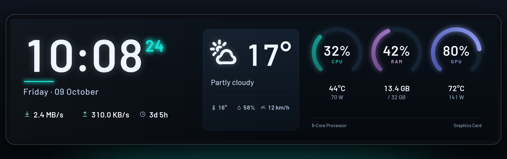</p>

<p align="center">
  <a href="https://github.com/syntensa/libre-panel/releases/latest"><b>Download</b></a> ·
  <a href="#themes">Themes</a> ·
  <a href="#the-theme-editor">Theme editor</a> ·
  <a href="docs/HARDWARE.md">Supported panels</a> ·
  <a href="#build-your-own-in-two-minutes">Build your own</a>
</p>

Plug in your panel, start Libre Panel, and it shows your PC's load,
temperatures, memory, network and the weather outside, in a design you pick
or build yourself. It runs quietly in the tray on Windows, Linux and macOS.
No account, no cloud, no vendor app.

- **Looks good out of the box.** Seven built-in themes from the 0.96" stick
  to the 9.2" bar, with glow, soft gradients, smooth graphs and values that
  glide instead of jumping.
- **Fits your machine without editing.** The names your own CPU and GPU
  report, the weather for the place in *your* config, dates in English or
  German, and sections that step aside where a sensor is missing.
- **24 modules.** Hardware down to every core, drive, fan and game frame,
  clocks for any time zone, sunrise and the moon, what is playing, your
  calendar, Home Assistant and MQTT values, a slideshow.
- **Snap it together.** Drag modules onto your panel's grid; pull a corner
  and a module shows more. Six looks restyle everything in one click, and a
  free editor is there for every pixel.
- **Smooth.** On TURZX USB panels, video mode plays up to 50 frames per
  second through the panel's own decoder, so graphs scroll and numbers glide.
- **Yours.** GPL-3.0, plain JSON themes that cannot run code, everything
  configurable in one file.

## Fits your machine

The same theme on different PCs: Studio shows a calendar sheet where the
weather would be when the weather is off, and the disk where the GPU would be
on a PC that reports no GPU readings. Any widget can do this with one field,
`needs` (see [Theme format](docs/THEMES.md#widgets)).

<p align="center">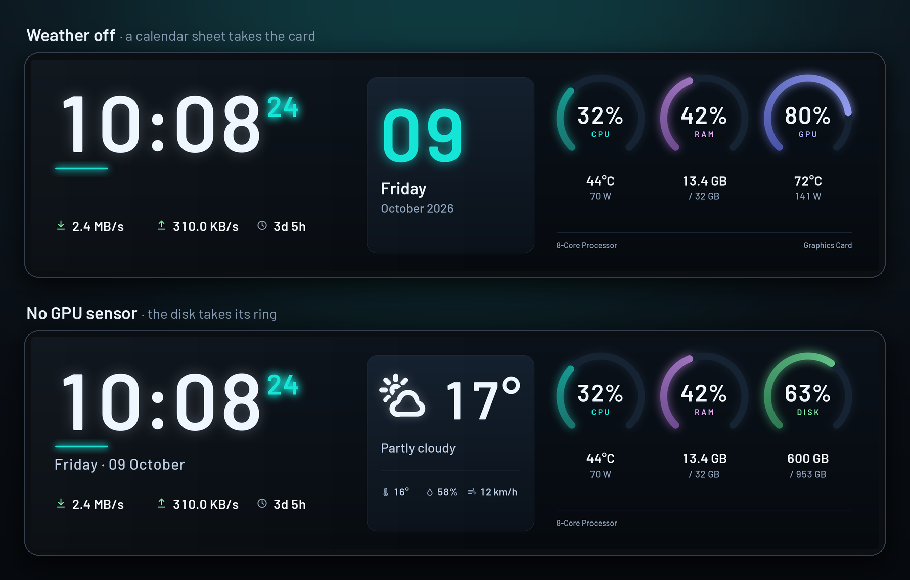</p>

## Build your own in two minutes

<p align="center">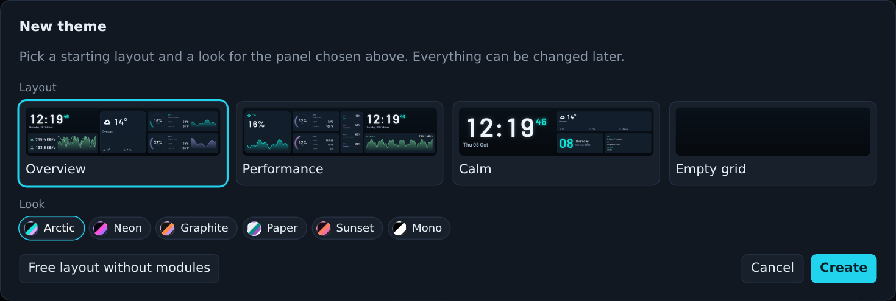</p>

**1. Pick a layout and a look.** *New* offers starting layouts made for the
panel you chose, in any of six looks.

<p align="center">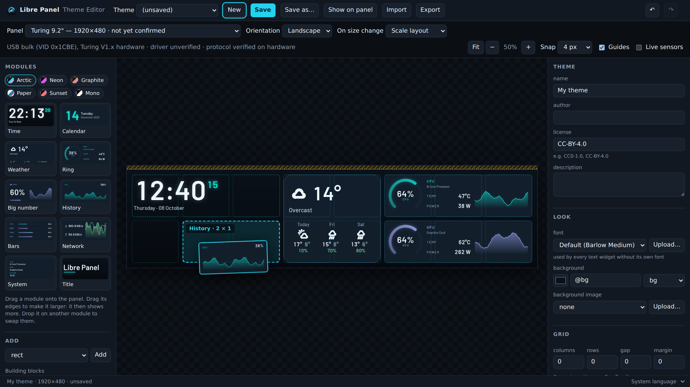</p>

**2. Drag modules onto the panel.** Pick from [24 modules](#24-modules):
hardware, clocks, weather, music, calendar and more. Free cells light up;
drop a module on another one to swap them.

<p align="center">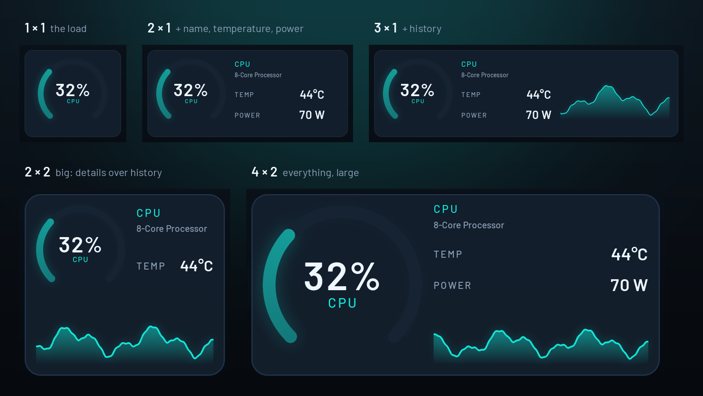</p>

**3. Pull a corner.** Modules work like widgets on a phone's home screen:
the larger, the more they show. A CPU ring of one cell shows the load; two
cells add the processor's name, temperature and power; three a history.

<p align="center">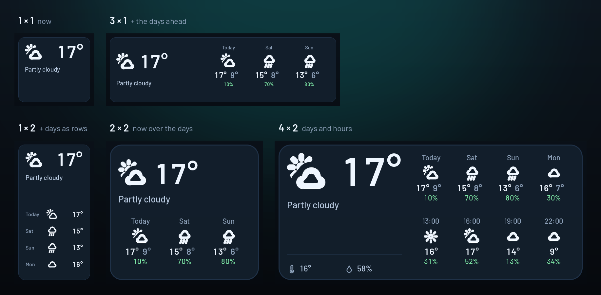</p>

The weather does the same: given room, it adds the forecast of the next
days or hours (you choose, or both), as columns when long or big and as
rows when tall. A big calendar shows the month.

<p align="center">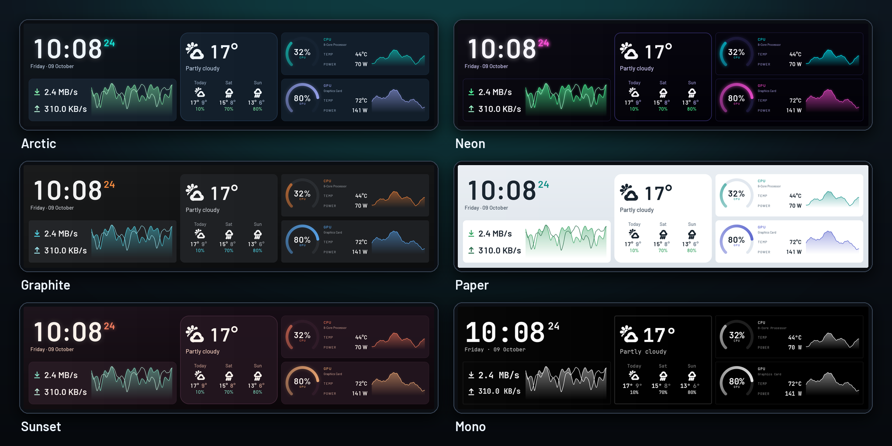</p>

**4. Try another look.** One click restyles colours, cards, corners, glow
and fonts of every module.

<p align="center">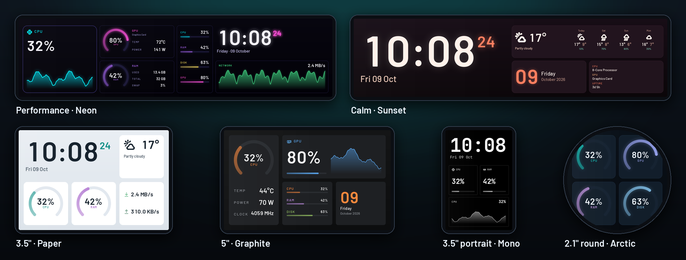</p>

**On every panel.** The grid follows the panel (8 × 2 cells on a 9.2" bar,
3 × 2 on a 3.5" panel) and keeps clear of edges the bezel hides; switch
the panel and the modules move along.

## 24 modules

<p align="center">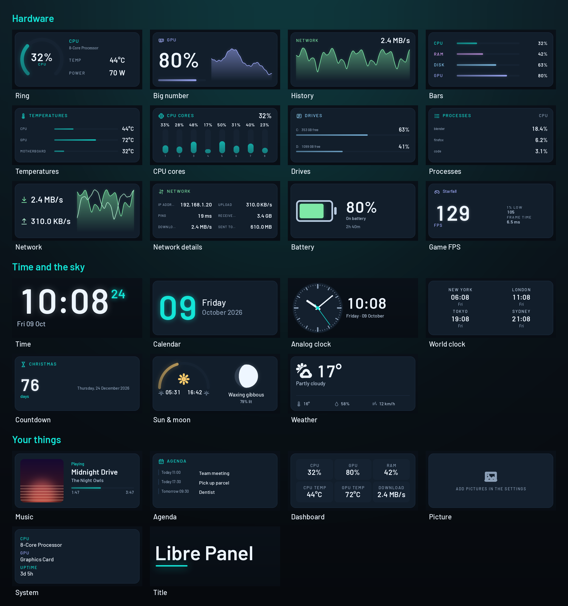</p>

- **Hardware.** Rings, big numbers, history graphs and bars; every
  temperature and fan, CPU and GPU first; the load of every core; every
  drive with its free space; the busiest programs; IP address, ping and
  today's traffic; the battery; the frame rate of your game, with its 1%
  lows (through Intel's PresentMon on Windows).
- **Time and the sky.** Digital and analog clocks, also for other time
  zones and as a world clock; a calendar sheet with the month; a countdown
  to any day (every year with "12-24"); sunrise, sunset and the moon's
  phase, computed for your place without the internet; the weather with
  its forecast.
- **Your things.** What is playing, with the cover (Windows media controls,
  Spotify, browsers, MPRIS players on Linux, Music on macOS); the next
  events of your calendars (Google, Outlook, iCloud, Nextcloud, any .ics);
  a dashboard of any readings, Home Assistant and MQTT included; pictures
  from the theme folder as a slideshow.

Like the others, each new module shows more the larger it is, steps aside
when its readings are missing ("Nothing playing", "No battery"), and costs
nothing while no theme shows it: processes, ping, music and the game's
frame rate are only read while they are on the panel.

<p align="center">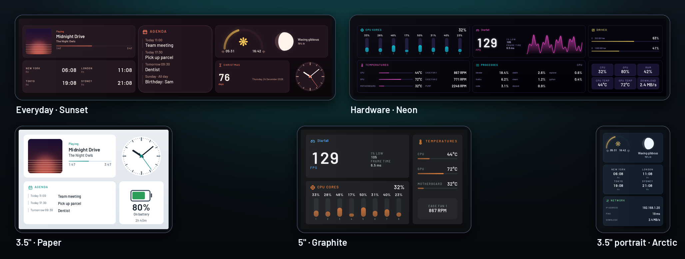</p>

Calendars, Home Assistant, MQTT and PresentMon are set up in the
[configuration](docs/CONFIGURATION.md#more-sensor-sources).

## Themes

<p align="center">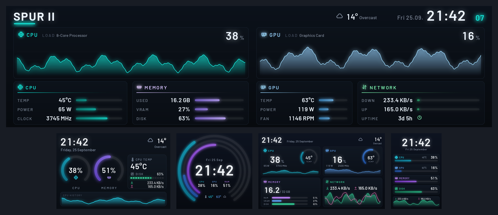</p>

| Theme | Panel | |
|---|---|---|
| `studio` | 8.8" / 9.2" bar (1920×480) | after SPUR II's Studio screen: large clock, weather for your location, CPU, RAM and GPU rings named after your hardware |
| `spur-ii` | 8.8" / 9.2" bar (1920×480) | the SPUR II layout: load charts, four sections, light on every value |
| `slate` | 5" (800×480) | four cards: CPU, GPU, memory, network |
| `libre-default` | 3.5" (480×320) | two rings, temperature, disk, network and history |
| `orbit` | round 2.1" / 2.8" (480×480) | three concentric rings around a large clock |
| `column` | 3.5" portrait (320×480) | clock, resource rows and network |
| `pico` | 0.96" (160×80) | CPU with temperature and memory, large numbers and slim bars |

Every theme moves to any other panel from the editor's panel menu. Themes
are plain JSON plus images and fonts — see [docs/THEMES.md](docs/THEMES.md).
Made one you like? Share it in
[Discussions](https://github.com/syntensa/libre-panel/discussions).

## The theme editor

<p align="center">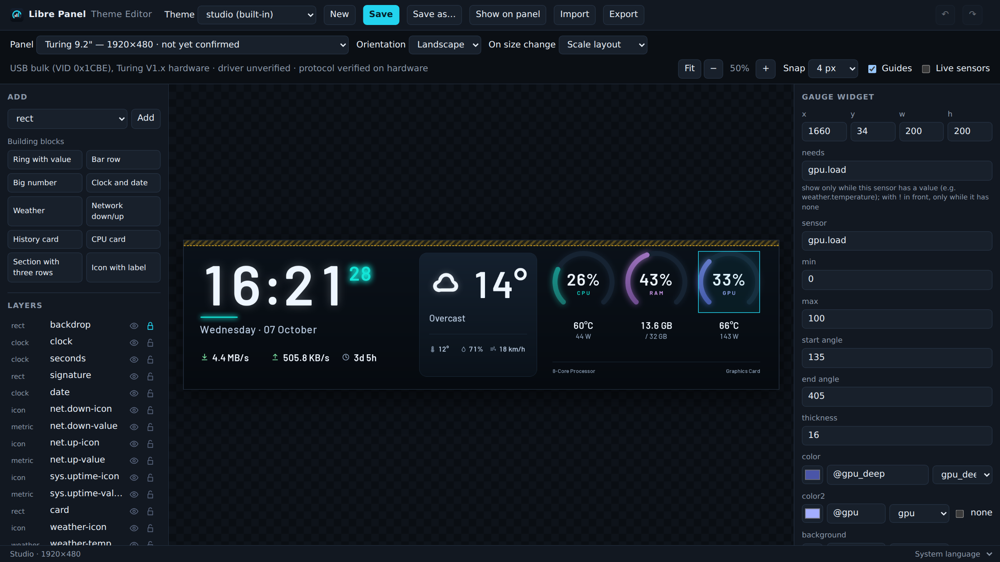</p>

- **Modules** from a library with live pictures in your look, on a grid:
  drag, drop, swap, resize at the edges. Their settings are plain choices:
  what it shows, title, colour, what to show when readings are missing.
  *Detach* turns a module into single widgets.
- **Free editing** of every widget: drag and drop with snapping and
  alignment guides, multi-select, align and distribute, undo/redo,
  copy/paste, layers with lock and hide, zoom, palette and font pickers.
- **Every panel size from a menu**: 0.96" up to 12.3", round ones too,
  portrait or landscape. Switching the panel rescales your layout.
- What you see is what the panel shows: the editor renders with the panel's
  own engine, with demo values or your live sensors. *Show on panel* sends
  it there.

## Features

- **Modules**: 24 building blocks that lay themselves out for their size,
  six looks, starting layouts for every panel size.
- **Widgets**: text, sensor values, bars (also segmented), ring gauges,
  smooth history graphs, lists of readings (`temp.*`) as rows, bars,
  columns or tiles, clocks (digital and analog, any time zone), countdowns,
  the month, the moon, images and slideshows, weather, 35 line icons (with
  live weather symbols), cards with frosted glass; glow, shadows, gradients,
  colour rules (e.g. turn red above 85 °C) and values that glide.
- **Video mode** for TURZX USB panels: up to 50 frames per second through
  the panel's own video decoder (needs ffmpeg).
- **Sensors**: CPU (every core), RAM, every drive, network, temperatures,
  fans, battery and the busiest programs via `psutil`; on Windows also GPU,
  power, every temperature and fan through
  [LibreHardwareMonitor](https://github.com/LibreHardwareMonitor/LibreHardwareMonitor).
- **From your life**: what is playing, calendars (.ics), Home Assistant,
  MQTT, sunrise, sunset and the moon, and the frame rate of games
  ([PresentMon](https://github.com/GameTechDev/PresentMon), Windows).
- **Weather** from [Open-Meteo](https://open-meteo.com) for your location:
  off by default, no API key.
- **Nothing hard-coded**: location, units, sensors and panel live in one
  config file.
- **English and German** in the editor, the tray and on the panel (dates,
  weather); follows the system language.
- **Safe to share themes**: themes are plain JSON plus images/fonts and
  cannot run code or read files outside their folder.
- **Runs in the background**: tray icon with theme, brightness, pause and
  quit; starts with the system if you want; picks up the panel whenever it
  is plugged in.
- **Plugins** ([plugin API](docs/PLUGINS.md)): services that publish
  readings and switch themes or modes, short messages on the panel,
  transitions, screens drawn in code, widget types, sensor sources, display
  drivers, themes and editor pages; installed with pip or as a folder.

## Panels

The driver for Turing/TURZX USB panels (4.6"–12.3", 2.8" round) has run for
hours on the 9.2", as still pictures and as 50 fps video; the other sizes
speak the same protocol. The serial panels have drivers too (Turing 2.1",
3.5", 5" and 8.8", UsbPCMonitor, XuanFang, Kipye, WeAct). A model is listed as
"supported" once `libre-panel doctor` has passed on it — see
[supported panels](docs/HARDWARE.md).

**Own one of these panels?** `libre-panel doctor` checks it end to end and
writes a report. Attach it to a
[panel report](https://github.com/syntensa/libre-panel/issues/new?template=panel_support.yml)
and your model moves from *unverified* to *supported* for everyone.

Without a panel you can still design themes and preview them.

## Install

Download from the [releases](https://github.com/syntensa/libre-panel/releases)
(no Python needed):

| System | Download | |
|---|---|---|
| Windows 10/11 | `libre-panel-…-windows-x64-setup.exe` | installs for your user (no admin rights), start menu entry, optional start at login; uninstall in *Settings → Apps* |
| macOS 11+ (Apple silicon) | `libre-panel-…-macos-arm64.dmg` | drag *Libre Panel* to *Applications*; lives in the menu bar |
| Linux (x86-64) | `Libre_Panel-…-x86_64.AppImage` | make it executable and double-click; no installation |

A portable Windows zip and a Linux tarball are there too. The downloads are
not code-signed yet: Windows SmartScreen asks once (*More info → Run
anyway*), and on macOS you open the app the first time with right-click →
*Open* (on macOS 15: *System Settings → Privacy & Security → Open Anyway*).
After the first start, the icon in the tray (menu bar) opens the theme editor; *Start with
system* makes it start at every login. More in
[Running in the background](docs/BACKGROUND.md).

With Python instead:

```bash
pipx install "libre-panel[usb,serial,tray] @ git+https://github.com/syntensa/libre-panel@v0.4.0"
libre-panel tray                    # background app with tray icon; opens the editor
libre-panel autostart enable        # start it whenever you log in
```

Other commands:

```bash
libre-panel                         # panel + editor in a terminal (Ctrl+C stops)
libre-panel editor                  # only the theme editor
libre-panel run                     # only drive the panel
libre-panel preview spur-ii -o spur.png   # render a theme to an image
libre-panel models                  # all known panels and their resolutions
libre-panel devices                 # which panel is connected?
libre-panel doctor                  # check the panel end to end, write a report
libre-panel quit                    # quit the background app
libre-panel udev-rules              # Linux: the rule that gives your user USB access
libre-panel sensors                 # every sensor key with its current value
libre-panel config init             # write a commented config.toml
libre-panel location "Berlin"       # coordinates for the weather config
```

Close the vendor app first; it keeps the panel to itself.

## Documentation

- [Supported panels](docs/HARDWARE.md)
- [Running in the background: tray, autostart](docs/BACKGROUND.md)
- [Configuration](docs/CONFIGURATION.md)
- [Theme format and sensor keys](docs/THEMES.md)
- [Plugins](docs/PLUGINS.md)
- [Architecture](docs/ARCHITECTURE.md)
- [TURZX USB protocol notes](docs/protocol/turzx-usb.md)
- [Serial panel protocols](docs/protocol/serial.md)
- [Roadmap](docs/ROADMAP.md)
- [Releasing](docs/RELEASING.md)
- [Contributing](CONTRIBUTING.md)

## Credits

Libre Panel stands on the shoulders of
[turing-smart-screen-python](https://github.com/mathoudebine/turing-smart-screen-python)
(GPL-3.0), whose reverse-engineering documents these panels, and of the SPUR II
project, which verified the USB protocol on real hardware. See [NOTICE.md](NOTICE.md).

"TURZX", "Turing Smart Screen" and other product names are trademarks of their
owners. Libre Panel is an independent project and not affiliated with them.

## License

[GPL-3.0-or-later](LICENSE). Bundled themes carry their own license, stated in
each `theme.json`.
